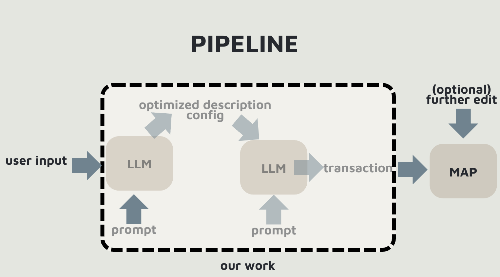
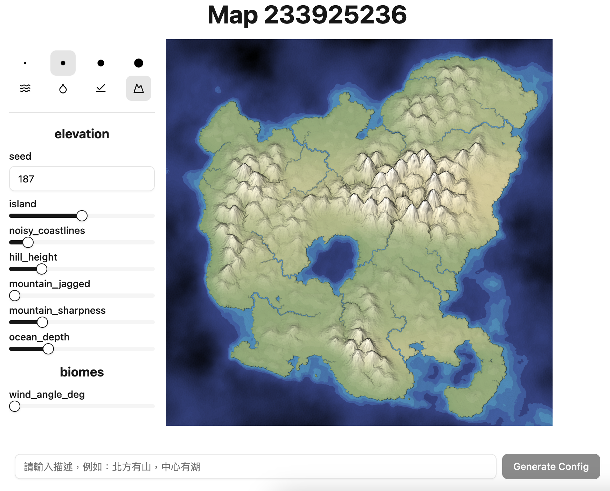

# Interactive Mapgen

This project enables users to generate fantasy-style maps directly from natural language descriptions. By combining a large language model (Grok-3-mini via xAI API) with the open-source tool [mapgen4](https://github.com/redblobgames/mapgen4), users can create and edit terrain-rich maps with minimal effort.

## Overview

We aim to simplify the map creation process for writers, game developers, and world-builders.
Users can input descriptions like:
```
“Generate mountains at the center, and a lake to the east.”
```
Our system interprets this input semantically, applies the appropriate transformations (transactions), and renders the map accordingly.



## Prerequisites
- node.js
- npm
- pnpm
- xAI API

## Installation

Install the required packages:

```bash
cd interactive-mapgen
pnpm install
```


Create a `.env` file inside the `interactive-mapgen` directory and add your API key:

```bash
# Note: This file is used for local development and should be ignored by Git via .gitignore
VITE_GROK_API_KEY="your-api-key-here"
```


Install [Mapgen4](https://github.com/redblobgames/mapgen4/) and follow [their instructions](https://github.com/redblobgames/mapgen4/?tab=readme-ov-file#install) to build it:

```bash
git clone https://github.com/redblobgames/mapgen4.git ./src/lib/mapgen4
cd src/lib/mapgen4

# Copied from Mapgen4 README, you can use either `npm` or `pnpm`.
npm install -g esbuild
npm install
./build.sh
```

Copy the `src/lib/mapgen4/build` directory to the `public` directory in this project:

```bash
cp -r ./build ../../../public/build
```

Then, go back to the root directory of this project:

```bash
cd ../../..
```

## Usage

Run the development server.

```bash
pnpm run dev
```
Go to localhost:5173, and you should see something like this



You can adjust the initial map by changing the seed on the left-hand side, or enter a description of your imagined map — the system will use AI to generate a map that matches your input.
If the generated map doesn't meet your expectations, you can manually modify it using any brush or terrain tool available. Have fun!
